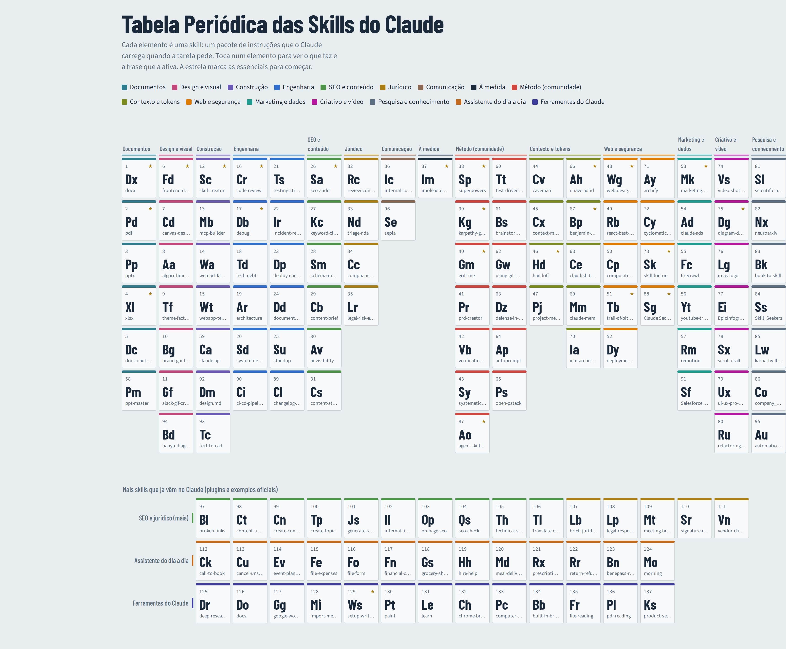

# Tabela Periódica das Skills do Claude

137 skills do Claude organizadas como uma tabela periódica, por famílias. Versão interativa: abre o `index.html` ou a página do GitHub Pages deste repositório.

★ = essencial para começar. Lista revista em outubro de 2026.

> Skills podem executar código. Lê o `SKILL.md` antes de instalar uma de fonte desconhecida.

## Documentos

| | Skill | O que faz | Origem |
|---|---|---|---|
| **Dx** ★ | docx | Cria e edita documentos Word com estilos, tabelas, imagens e alterações controladas. | Anthropic |
| **Pd** ★ | pdf | Cria, junta, divide, preenche formulários e extrai texto ou tabelas de PDFs. | Anthropic |
| **Pp** | pptx | Gera e edita apresentações PowerPoint com layouts e notas de orador. | Anthropic |
| **Xl** ★ | xlsx | Folhas de cálculo com fórmulas, formatação, gráficos e limpeza de dados. | Anthropic |
| **Dc** | doc-coauthoring | Escreve documentos longos em conjunto contigo, secção a secção, com revisão. | Anthropic |
| **Pm** | ppt-master | Gera PowerPoint nativo e editável a partir de documentos: formas, gráficos com dados, masters e animações. Precisa de Python 3.10+. Projeto de um só autor; as recomendações de modelos no README são patrocinadas. | Comunidade · [`hugohe3/ppt-master`](https://github.com/hugohe3/ppt-master) |

## Design e visual

| | Skill | O que faz | Origem |
|---|---|---|---|
| **Fd** ★ | frontend-design | Dá direção visual própria a páginas e interfaces, fugindo ao aspeto de template. | Anthropic |
| **Cd** | canvas-design | Cria pósteres e peças visuais estáticas em PNG ou PDF. | Anthropic |
| **Aa** | algorithmic-art | Arte generativa com código (p5.js), com parâmetros ajustáveis. | Anthropic |
| **Tf** | theme-factory | Aplica temas de cor e tipografia prontos a slides, docs e páginas. | Anthropic |
| **Bg** | brand-guidelines | Mantém as cores e a tipografia de uma marca em tudo o que é criado. | Anthropic |
| **Gf** | slack-gif-creator | Cria GIFs animados otimizados para o Slack. | Anthropic |
| **Bd** | baoyu-diagram | Diagramas em SVG com um sistema de design escuro e consistente. | Comunidade · [`JimLiu/baoyu-skills`](https://github.com/JimLiu/baoyu-skills) |

## Construção

| | Skill | O que faz | Origem |
|---|---|---|---|
| **Sc** ★ | skill-creator | Cria, testa e melhora skills novas. É a skill que faz skills. | Anthropic |
| **Mb** | mcp-builder | Constrói servidores MCP para ligar o Claude a APIs e serviços externos. | Anthropic |
| **Wa** | web-artifacts-builder | Aplicações web mais complexas com React, Tailwind e componentes. | Anthropic |
| **Wt** | webapp-testing | Testa aplicações web com Playwright: cliques, formulários, capturas de ecrã. | Anthropic |
| **Ca** | claude-api | Ajuda a construir apps com a API do Claude: modelos, ferramentas, streaming, batch. | Anthropic · [`anthropics/skills`](https://github.com/anthropics/skills) |
| **Dm** | design.md | Um contrato de design persistente que o agente segue em todas as sessões: cores, tipografia, componentes. | Comunidade (Google Labs) · [`google-labs-code/design.md`](https://github.com/google-labs-code/design.md) |
| **Tc** | text-to-cad | Descreves uma peça e o agente exporta STEP, STL e 3MF, gera G-code e pode enviar para impressora 3D. | Comunidade · [`earthtojake/text-to-cad`](https://github.com/earthtojake/text-to-cad) |

## Engenharia

| | Skill | O que faz | Origem |
|---|---|---|---|
| **Cr** ★ | code-review | Revê alterações de código: segurança, desempenho e casos limite. | Plugin |
| **Db** ★ | debug | Depuração estruturada: reproduzir, isolar, diagnosticar, corrigir. | Plugin |
| **Td** | tech-debt | Identifica e prioriza dívida técnica. | Plugin |
| **Ar** | architecture | Escreve e avalia registos de decisão de arquitetura (ADR). | Plugin |
| **Sd** | system-design | Desenha sistemas, APIs e modelos de dados. | Plugin |
| **Ts** | testing-strategy | Define a estratégia e o plano de testes. | Plugin |
| **Ir** | incident-response | Triagem de incidentes, comunicação e postmortem. | Plugin |
| **Dp** | deploy-checklist | Checklist antes de publicar: migrações, flags, rollback. | Plugin |
| **Dd** | documentation | READMEs, runbooks, guias de onboarding e docs de API. | Plugin |
| **Su** | standup | Transforma a atividade recente num resumo de standup. | Plugin |
| **Cl** | changelog-generator | Gera notas de versão a partir dos commits e verifica se as mensagens seguem o padrão. | Comunidade · [`alirezarezvani/claude-skills`](https://github.com/alirezarezvani/claude-skills) |
| **Ci** | ci-cd-pipeline-builder | Deteta a stack do projeto e gera o pipeline de CI/CD. | Comunidade · [`alirezarezvani/claude-skills`](https://github.com/alirezarezvani/claude-skills) |

## SEO e conteúdo

| | Skill | O que faz | Origem |
|---|---|---|---|
| **Sa** ★ | seo-audit | Auditoria SEO completa de um site ou código. | Plugin |
| **Kc** | keyword-cluster | Agrupa palavras-chave em temas e mapeia-as para páginas. | Plugin |
| **Sm** | schema-markup | Gera dados estruturados JSON-LD prontos a colar. | Plugin |
| **Cb** | content-brief | Brief detalhado antes de escrever um artigo. | Plugin |
| **Av** | ai-visibility | Melhora como a marca aparece nas respostas de IAs (GEO). | Plugin |
| **Cs** | content-strategy | Planeia calendário editorial e lacunas de conteúdo. | Plugin |
| **Bl** | broken-links | Encontra e corrige links partidos e erros 404 no site ou no código. | Plugin (SearchFit) |
| **Ct** | content-translation | Traduz e adapta o site para SEO internacional, com etiquetas hreflang. | Plugin (SearchFit) |
| **Cn** | create-content | Escreve um artigo otimizado para uma palavra-chave: título, meta, títulos, corpo, links internos e schema. | Plugin (SearchFit) |
| **Tp** | create-topic | Planeia um tema antes de escrever: palavras-chave, ângulo, público e posição face à concorrência. | Plugin (SearchFit) |
| **Js** | generate-schema | Gera o JSON-LD de uma página, pronto a colar. | Plugin (SearchFit) |
| **Il** | internal-linking | Analisa e melhora as ligações internas entre páginas, incluindo páginas órfãs. | Plugin (SearchFit) |
| **Op** | on-page-seo | Otimiza uma página concreta para uma palavra-chave: meta tags, títulos e conteúdo. | Plugin (SearchFit) |
| **Qs** | seo-check | Verificação rápida de uma página: título, meta, títulos, imagens e dados estruturados. | Plugin (SearchFit) |
| **Th** | technical-seo | Auditoria técnica: velocidade, Core Web Vitals, indexação, robots.txt e sitemap. | Plugin (SearchFit) |
| **Tl** | translate-content | Tradução com pesquisa de palavras-chave e adaptação cultural, não palavra a palavra. | Plugin (SearchFit) |

## Jurídico

| | Skill | O que faz | Origem |
|---|---|---|---|
| **Rc** | review-contract | Revê contratos cláusula a cláusula e sugere alterações. | Plugin |
| **Nd** | triage-nda | Classifica NDAs em verde, amarelo ou vermelho. | Plugin |
| **Cc** | compliance-check | Verifica regulamentação aplicável (ex.: RGPD) a uma ação ou produto. | Plugin |
| **Lr** | legal-risk-assessment | Classifica riscos legais por gravidade e probabilidade. | Plugin |
| **Lb** | brief (jurídico) | Briefing jurídico: resumo do dia, pesquisa de um tema ou resposta rápida a um incidente. | Plugin (Anthropic) |
| **Lp** | legal-response | Responde a pedidos jurídicos comuns com modelos e avisa quando um caso não deve levar resposta de modelo. | Plugin (Anthropic) |
| **Mt** | meeting-briefing | Prepara reuniões com peso jurídico e acompanha as ações que saem delas. | Plugin (Anthropic) |
| **Sr** | signature-request | Checklist antes de assinar e envio para assinatura eletrónica, com a ordem dos assinantes. | Plugin (Anthropic) |
| **Vn** | vendor-check | Estado dos acordos com um fornecedor: o que está assinado, o que falta e os prazos. | Plugin (Anthropic) |

## Comunicação

| | Skill | O que faz | Origem |
|---|---|---|---|
| **Ic** | internal-comms | Comunicações internas: atualizações, newsletters, FAQs, relatórios. | Anthropic |
| **Se** | sepia | Tira o tom de IA aos textos: release notes, respostas, posts e ficção, com regras para cada tipo de texto. | Comunidade · [`Nanako0129/sepia`](https://github.com/Nanako0129/sepia) |

## À medida

| | Skill | O que faz | Origem |
|---|---|---|---|
| **Im** ★ | imolead-engenheira-principal | Engenheira principal do ImoLead AI: conhece a arquitetura e conduz melhorias seguras. | Tua |

## Método (comunidade)

| | Skill | O que faz | Origem |
|---|---|---|---|
| **Sp** ★ | superpowers | Fluxo completo de desenvolvimento: brainstorm, plano, subagentes por tarefa, testes primeiro e revisão antes do merge. Das coleções mais populares do ecossistema. | Comunidade · [`obra/superpowers`](https://github.com/obra/superpowers) |
| **Kg** ★ | karpathy-guidelines | Quatro regras de comportamento para código: não assumir em silêncio, não complicar, não mexer no que não foi pedido. | Comunidade · [`forrestchang/andrej-karpathy-skills`](https://github.com/forrestchang/andrej-karpathy-skills) |
| **Gm** ★ | grill-me | Interroga-te sobre o plano até haver entendimento partilhado, antes de escrever código. | Comunidade · [`mattpocock/skills`](https://github.com/mattpocock/skills) |
| **Pr** | prd-creator | Gera o documento de requisitos do produto: funcionalidades, limites e tarefas. | Comunidade · [`PageAI-Pro/ralph-loop`](https://github.com/PageAI-Pro/ralph-loop) |
| **Vb** | verification-before-completion | Obriga o Claude a verificar o trabalho antes de dizer que está feito. | Comunidade · [`obra/superpowers`](https://github.com/obra/superpowers) |
| **Sy** | systematic-debugging | Encontra a causa raiz com evidência em vez de tentar correções às cegas. | Comunidade · [`obra/superpowers`](https://github.com/obra/superpowers) |
| **Tt** | test-driven-development | Escreve o teste antes do código, em cada funcionalidade ou correção. | Comunidade · [`obra/superpowers`](https://github.com/obra/superpowers) |
| **Bs** | brainstorming | Transforma uma ideia vaga num desenho completo, com perguntas e alternativas. | Comunidade · [`obra/superpowers`](https://github.com/obra/superpowers) |
| **Gw** | using-git-worktrees | Cria worktrees isoladas para trabalhar sem sujar a pasta principal, com verificações de segurança. | Comunidade · [`obra/superpowers`](https://github.com/obra/superpowers) |
| **Dz** | defense-in-depth | Validação em várias camadas: entrada, regra de negócio, base de dados e testes. | Comunidade · [`obra/superpowers`](https://github.com/obra/superpowers) |
| **Ap** | autoprompt | Envolve o agente num ciclo de plano, construção, revisão, teste e aprovação. Menos falhas, mas cerca de 3x mais tempo e 2x mais tokens, segundo o próprio autor. | Comunidade · [`Spielewoy/autoprompt-skill`](https://github.com/Spielewoy/autoprompt-skill) |
| **Ps** | open-pstack | Port do pstack usado no Cursor: percebe o sistema antes de mudar, prefere mudanças pequenas e corre o código para provar. | Comunidade · [`ericlitman/open-pstack`](https://github.com/ericlitman/open-pstack) |
| **Ao** ★ | agent-skills (Addy Osmani) | 24 skills com as práticas de engenharia da Google: especificação, plano, construção, testes, revisão e lançamento, com comandos /spec, /plan, /build, /test, /review e /ship. | Comunidade (Google) · [`addyosmani/agent-skills`](https://github.com/addyosmani/agent-skills) |

## Contexto e tokens

| | Skill | O que faz | Origem |
|---|---|---|---|
| **Cv** | caveman | Respostas curtíssimas sem palha: corta em média cerca de dois terços dos tokens de saída, mantendo o código intacto. | Comunidade · [`JuliusBrussee/caveman`](https://github.com/JuliusBrussee/caveman) |
| **Cx** | context-mode | Filtra o ruído dos comandos do terminal e repõe o estado da sessão quando o contexto reinicia. | Comunidade · [`mksglu/context-mode`](https://github.com/mksglu/context-mode) |
| **Hd** ★ | handoff | Resume a sessão num documento para continuar numa sessão nova ou passar a outro agente. | Comunidade · [`mattpocock/skills`](https://github.com/mattpocock/skills) |
| **Pj** | project-memory | Mantém um resumo do projeto entre sessões para não repetires o contexto. | Comunidade · [`SpillwaveSolutions/project-memory`](https://github.com/SpillwaveSolutions/project-memory) |
| **Ah** ★ | i-have-adhd | Dez regras de saída: a resposta primeiro, passos numerados, no máximo cinco itens por lista, sem frases de enchimento. | Comunidade · [`ayghri/i-have-adhd`](https://github.com/ayghri/i-have-adhd) |
| **Bp** ★ | benjamin-plus | Cinco hábitos para gastar menos: juntar pesquisas, ler só o necessário, verificar com o comando da tarefa. Funciona melhor colado no CLAUDE.md do que como pasta de skill. | Comunidade (JetBrains) · [`JetBrains/benjamin-plus-skill`](https://github.com/JetBrains/benjamin-plus-skill) |
| **Ce** | claudish-to-english | Reescreve as respostas do agente em linguagem simples no ecrã, sem mudar o que fica gravado. | Comunidade · [`gvzdv/claudish-to-english`](https://github.com/gvzdv/claudish-to-english) |
| **Mm** | claude-mem | Memória persistente: guarda o contexto entre sessões do Claude Code. | Comunidade · [`thedotmack/claude-mem`](https://github.com/thedotmack/claude-mem) |
| **Ia** | icm-architect | Transforma um processo numa estrutura de pastas e markdown onde o agente trabalha sem código de orquestração. Tem modo de construção e de reorganização. | Comunidade · [`RinDig/icm-architect`](https://github.com/RinDig/icm-architect) |

## Web e segurança

| | Skill | O que faz | Origem |
|---|---|---|---|
| **Wg** ★ | web-design-guidelines | Audita a interface contra mais de 100 regras de acessibilidade e UX, com resultados por ficheiro e linha. | Comunidade (Vercel) · [`vercel-labs/agent-skills`](https://github.com/vercel-labs/agent-skills) |
| **Rb** | react-best-practices | 57 regras de desempenho para React e Next.js, ordenadas por impacto. | Comunidade (Vercel) · [`vercel-labs/agent-skills`](https://github.com/vercel-labs/agent-skills) |
| **Cp** | composition-patterns | Troca componentes cheios de props booleanas por componentes compostos limpos. | Comunidade (Vercel) · [`vercel-labs/agent-skills`](https://github.com/vercel-labs/agent-skills) |
| **Tb** ★ | trail-of-bits-security | Análise de segurança profissional com CodeQL e Semgrep e procura de variantes de vulnerabilidades. | Comunidade (Trail of Bits) · [`trailofbits/skills`](https://github.com/trailofbits/skills) |
| **Dy** | deployment-procedures | Boas práticas antes de publicar, para não expor chaves nem dados sensíveis. | Comunidade · [`davila7/claude-code-templates`](https://github.com/davila7/claude-code-templates) |
| **Ay** | archify | Mapa interativo da arquitetura a partir do código, com antes e depois para rever uma mudança antes do merge. | Comunidade · [`tt-a1i/archify`](https://github.com/tt-a1i/archify) |
| **Cy** | cyclomatic-complexity | Mede a complexidade de cada função e refatora primeiro as piores, com tabela de antes e depois. | Comunidade · [`saurabhkumar8112/cyclomatic-complexity-skill`](https://github.com/saurabhkumar8112/cyclomatic-complexity-skill) |
| **Sk** ★ | skilldoctor | Verifica uma skill antes de a instalares: injeção de prompts, leitura de .env ou chaves SSH, permissões amplas, curl para shell. | Comunidade · [`xyiqq/skilldoctor`](https://github.com/xyiqq/skilldoctor) |
| **Sg** ★ | Claude Security | Análise de vulnerabilidades com vários agentes ao código todo. Tu escolhes os achados e ele prepara as correções, que aplicas tu. | Anthropic (plugin) |

## Marketing e dados

| | Skill | O que faz | Origem |
|---|---|---|---|
| **Mk** ★ | marketingskills | Pacote de marketing: CRO, copywriting, SEO, anúncios, email e analytics. Todas leem um ficheiro único com o teu produto e público. | Comunidade · [`coreyhaines31/marketingskills`](https://github.com/coreyhaines31/marketingskills) |
| **Ad** | claude-ads | Auditoria de contas de anúncios (Google, Meta, Microsoft) com pontuação e lista de correções. | Comunidade · [`AgriciDaniel/claude-ads`](https://github.com/AgriciDaniel/claude-ads) |
| **Fc** | firecrawl | Recolha de dados da web: extrair páginas, pesquisar e percorrer sites inteiros. Uso intenso precisa de chave paga. | Comunidade (Firecrawl) · [`firecrawl/firecrawl`](https://github.com/firecrawl/firecrawl) |
| **Yt** | youtube-transcript | Obtém a transcrição de vídeos do YouTube para resumir ou tirar notas. | Comunidade · [`michalparkola/tapestry-skills`](https://github.com/michalparkola/tapestry-skills) |
| **Rm** | remotion | Vídeo feito com código em React: animações, legendas, áudio. | Comunidade (Remotion) · [`remotion-dev/skills`](https://github.com/remotion-dev/skills) |
| **Sf** | Salesforce in Claude | Traz contas, oportunidades e pipeline do Salesforce para o Claude, com 37 skills de vendas prontas. | Anthropic + Salesforce (plugin) |

## Criativo e vídeo

| | Skill | O que faz | Origem |
|---|---|---|---|
| **Vs** | video-shotcraft | Estúdio de vídeo de produto: descreves o plano e o agente cria e renderiza em React com Remotion. Empresas precisam de licença paga do Remotion. | Comunidade · [`Vincentwei1021/video-shotcraft`](https://github.com/Vincentwei1021/video-shotcraft) |
| **Dg** ★ | diagram-design | 28 tipos de diagrama (arquitetura, fluxos, sequência, organogramas) em HTML com SVG, usando as cores da tua marca. | Comunidade · [`cathrynlavery/diagram-design`](https://github.com/cathrynlavery/diagram-design) |
| **Lg** | ip-as-logo | Logótipos de mascote simples: propõe três direções e gera seis candidatos com regras rígidas de forma e cor. | Comunidade · [`s1dashu/ip-as-logo-skill`](https://github.com/s1dashu/ip-as-logo-skill) |
| **Ei** | EpicInfographics | Infografias com aspeto de estúdio, fugindo aos cartões arredondados, ao azul por omissão e aos emojis. | Comunidade · [`OrRon/EpicInfographics`](https://github.com/OrRon/EpicInfographics) |
| **Sx** | scroll-craft | Sites em que o scroll é a linha do tempo da animação, com contraste e leitura em telemóvel garantidos. | Comunidade · [`nateherkai/scroll-craft`](https://github.com/nateherkai/scroll-craft) |
| **Ux** | ui-ux-pro-max | Biblioteca de estilos, paletas e regras de UX para interfaces mais profissionais. | Comunidade · [`nextlevelbuilder/ui-ux-pro-max-skill`](https://github.com/nextlevelbuilder/ui-ux-pro-max-skill) |
| **Ru** | refactoring-ui | Regras do livro Refactoring UI: escalas fixas de espaço, tipo, cor e sombra, e um quadro que diz porque algo parece mal. | Comunidade · [`s0xDk/refactoring-ui-skill`](https://github.com/s0xDk/refactoring-ui-skill) |

## Pesquisa e conhecimento

| | Skill | O que faz | Origem |
|---|---|---|---|
| **Sl** | scientific-agent-skills | 163 skills de investigação ligadas a mais de 100 bases de dados científicas. Instala só as que precisas. | Comunidade · [`K-Dense-AI/scientific-agent-skills`](https://github.com/K-Dense-AI/scientific-agent-skills) |
| **Nx** | neuroarxiv | Antes de inventar um algoritmo, procura artigos no arXiv e recomenda uma abordagem com fontes. | Comunidade · [`UditAkhourii/neuroarxiv`](https://github.com/UditAkhourii/neuroarxiv) |
| **Bk** | book-to-skill | Transforma um livro técnico (PDF, EPUB, DOCX) numa skill que o agente consulta capítulo a capítulo. | Comunidade · [`Leutenegger/book-to-skill`](https://github.com/Leutenegger/book-to-skill) |
| **Ss** | Skill_Seekers | Converte sites de documentação, repositórios e PDFs em skills do Claude. | Comunidade · [`yusufkaraaslan/Skill_Seekers`](https://github.com/yusufkaraaslan/Skill_Seekers) |
| **Lw** | karpathy-llm-wiki | Mantém uma wiki pessoal em markdown a partir de fontes, com páginas compiladas e consultas. | Comunidade · [`Astro-Han/karpathy-llm-wiki`](https://github.com/Astro-Han/karpathy-llm-wiki) |
| **Co** | company_skill | Pesquisa sobre empresas a partir de fontes públicas, com registo de onde vem cada número. | Comunidade · [`kelvinfkr/company_skill`](https://github.com/kelvinfkr/company_skill) |
| **Au** | automation-advisor | Calcula o retorno e o ponto de equilíbrio antes de decidires automatizar uma tarefa. | Comunidade · [`glebis/claude-skills`](https://github.com/glebis/claude-skills) |

## Assistente do dia a dia

| | Skill | O que faz | Origem |
|---|---|---|---|
| **Ck** | call-to-book | Faz uma chamada para marcar consulta ou reserva: vê a agenda, pede autorização antes de ligar e diz que é uma IA. | Anthropic (exemplo) |
| **Cu** | cancel-unsubscribe | Cancela subscrições a partir de uma descrição, de uma linha do extrato ou de uma captura de ecrã. Também revê o extrato todo. | Anthropic (exemplo) |
| **Ev** | event-planning | Planeia eventos, de um jantar a um casamento: local, convidados, horários, fornecedores e orçamento. | Anthropic (exemplo) |
| **Fe** | file-expenses | Submete despesas em plataformas como Expensify, Concur ou Brex, encontra recibos e evita duplicados. | Anthropic (exemplo) |
| **Fo** | file-form | Trata de papelada: multas, renovação de documentos, formulários e licenças. | Anthropic (exemplo) |
| **Fn** | financial-calculator | Cálculos e comparação de cenários: impostos, crédito, reforma, arrendar ou comprar. Só matemática, sem acesso a contas. | Anthropic (exemplo) |
| **Gs** | grocery-shopping | Compras ao domicílio: escolha da loja, lista, orçamento e carrinho. | Anthropic (exemplo) |
| **Hh** | hire-help | Encontra e marca um profissional: limpezas, reparações, mudanças, montagens. Pensada para plataformas dos EUA. | Anthropic (exemplo) |
| **Md** | meal-delivery | Encomenda comida para chegar a uma hora certa, calculando para trás. | Anthropic (exemplo) |
| **Rx** | prescription-refill | Pede a renovação de uma receita na farmácia a partir do nome, do número ou de uma foto da embalagem. | Anthropic (exemplo) |
| **Rr** | return-refund | Devoluções e reembolsos: encontra a política da loja, trata do processo e da etiqueta de envio. | Anthropic (exemplo) |
| **Bn** | benepass-reimbursement | Reembolsos pela plataforma Benepass, para quem a tem na empresa. | Anthropic (exemplo) |
| **Mo** | morning | O teu briefing da manhã numa página, ou agendado para todos os dias úteis. | Anthropic (exemplo) |

## Ferramentas do Claude

| | Skill | O que faz | Origem |
|---|---|---|---|
| **Dr** | deep-research | Pesquisa em muitas fontes, compara opções e entrega um relatório com as fontes. | Anthropic (exemplo) |
| **Do** | docs | Claude Docs: documentos vivos que se partilham, comentam e editam em equipa, e se exportam para Word ou PDF. | Anthropic |
| **Gg** | google-workspace | Cria e edita Google Docs, Sheets e Slides no teu Drive. | Anthropic (exemplo) |
| **Mi** | import-memory | Importa a memória de outro assistente de IA para a memória do Claude. | Anthropic (exemplo) |
| **Ws** ★ | setup-writing-style | Aprende como escreves a partir das tuas mensagens e documentos e cria um perfil de voz, para os rascunhos soarem a ti. | Anthropic (exemplo) |
| **Pt** | paint | Pinta imagens originais em estilo aguarela, escritas em código, sem modelo de imagem. | Anthropic (exemplo) |
| **Le** | learn | Modo professor: explica como e porquê algo funciona, com exemplos, perguntas e flashcards. | Anthropic (exemplo) |
| **Ch** | chrome-browser | Regras para o Claude usar o teu Chrome através da extensão Claude in Chrome. | Anthropic (exemplo) |
| **Pc** | computer-use | Usa apps no teu computador e vê o ecrã, a partir da app desktop. | Anthropic (exemplo) |
| **Bb** | built-in-browser | Usa o navegador que vem dentro da app Claude Desktop. | Anthropic (exemplo) |
| **Fr** | file-reading | Escolhe a forma certa de ler cada ficheiro enviado: PDF, Excel, imagens, arquivos comprimidos. | Anthropic |
| **Pl** | pdf-reading | Lê e extrai texto, tabelas, imagens e campos de formulário de PDFs, incluindo digitalizados. | Anthropic |
| **Ks** | product-self-knowledge | Factos verificados sobre os produtos da Anthropic: Claude Code, API, planos e limites. | Anthropic |

## Contribuir

Conheces uma skill que devia estar aqui? Usa o formulário da página, manda mensagem no Instagram [@carlosperes719](https://www.instagram.com/carlosperes719/) ou abre uma **Issue** com o modelo "Sugerir uma skill" ou lê o [CONTRIBUTING.md](CONTRIBUTING.md).

## Como instalar uma skill

No Claude Code, a maioria instala com `npx skills add <dono>/<repositório>`, ou copiando a pasta da skill para `.claude/skills/` no projeto. No Claude.ai, carrega a pasta da skill em ZIP.

---
Conteúdo sob licença [CC BY 4.0](LICENSE): podes partilhar e adaptar, desde que dês crédito ao autor.

Feito por Carlos · Instagram [@carlosperes719](https://www.instagram.com/carlosperes719/) · [Shalon Soluções Tecnológicas](https://shalon.pt)
